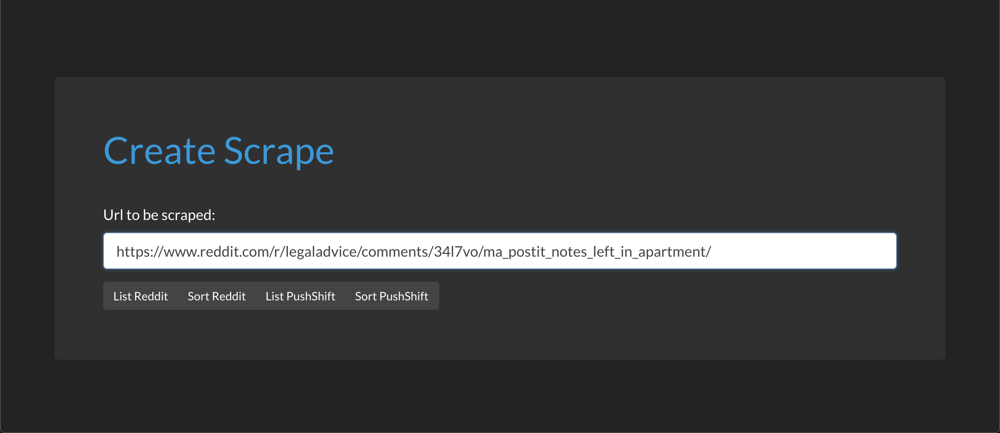
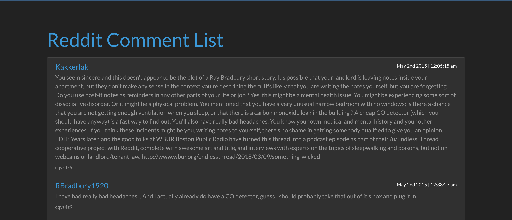
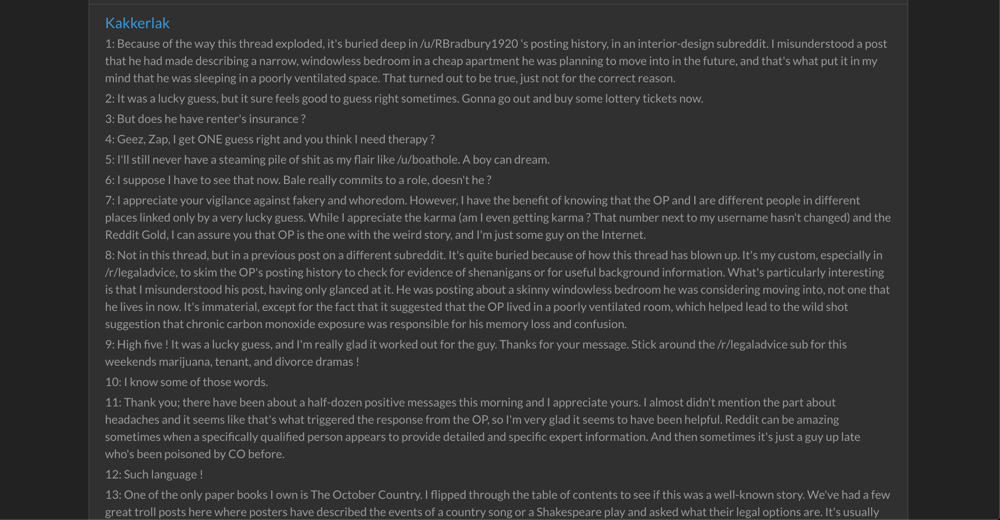

Scraping Reddit
========
May 2019 - Present
------------------
## Version 2.0 of my first independent project which explored creating a Reddit comment scraper with Node.js.

### Overview:
Node.js app built with the ultimate goal of scraping Reddit comments to utilize NLP/ML processes for tracking user/troll/bot behaviors in order to recognize disinformation patterns and analyze sentiment within a subreddit community.

### State of project:
The project is still in development. There are several other features I would like to implement that would track and analyze disinformation campaigns. This app is not currently out-of-the-box user-friendly, but I intend to make the interface more robust in a future update.

### How to run and use:
- Clone and npm install dependencies.
- Create directory named `/bin/` use the `example.www` as template and rename `www` inside of `/bin/`.
- Navigate to app homepage at localhost://2026. 
- Click on 'Create a scrape' to go to the scrape form. 
- Input a valid Reddit comment thread URL to analyze, using the following format:
`https://www.reddit.com/r/legaladvice/comments/34l7vo/ma_postit_notes_left_in_apartment/`

After filling in your desired URL, choose between 2 scrape sources:
- Request JSON directly from Reddit. 
- Archived version of the comment thread from Pushshift.

Choose which method to have the response display returned in:
- List method will grab each comment and its metadata along with any subsequent child response, then flatten all threads found.
- Sort method will only target each comment's `author: comment` and then sort the results by `author`.

NOTE:  Using either of the Reddit scrape methods will not yield a complete set of comments due to Reddit not serving more than ~1500 comments. Pushshift's methods will serve a complete dataset, but all of comments' scores will generally be incorrect. This is due to how and when Pushshift grabs comments for archival.

### Version 2.0 Design Decisions & Project Issues:
While taking a short break from building v.1.0, I attained a deeper understanding of various JavaScript foundational concepts and decided to apply these lessons by creating a second version of the scraper. This version addressed many of the flawed design approaches that were previously inefficient or insecure.

The first of these design changes was to structure the app in a way that aligns with industry best practices in application architecture.  By using general purpose functions I reduced repetitive code, which allows for scalability and less errors.

I researched and removed any unnecessary or outdated modules & practices after generating the Express application. During this process, I chose to use the Winston error handling module to manage errors along with the default Morgan http error handler. Originally this decision was made because it seemed like Winston was the most popular error handler but I now believe a basic, handmade error handler would have been a simpler solution. This was due to several issues arising from Winston v.3.0 that spurred many open issues on Github that have yet to be resolved. I ended up deciding not to implement all of the various features Winston has because I needed to spend more time exploring how to handle local errors with it.

Finally, I decided to to utilize Async-Await & Promises to handle my asynchronous functions. I learned about the pitfalls of error catching in asynchronous functions, as well as handing an instantiated variable a value from the resolution of a promise. I incorporated more ES6+ syntax while exploring the various ways to use arrow functions in `then()` statements.  By learning about ES6 features, I was able to utilize more destructured Objects.

### Resources:
- [Pushshift.io](https://pushshift.io/)
- [Pushshift Documentation](https://pushshift.io/api-parameters/)
